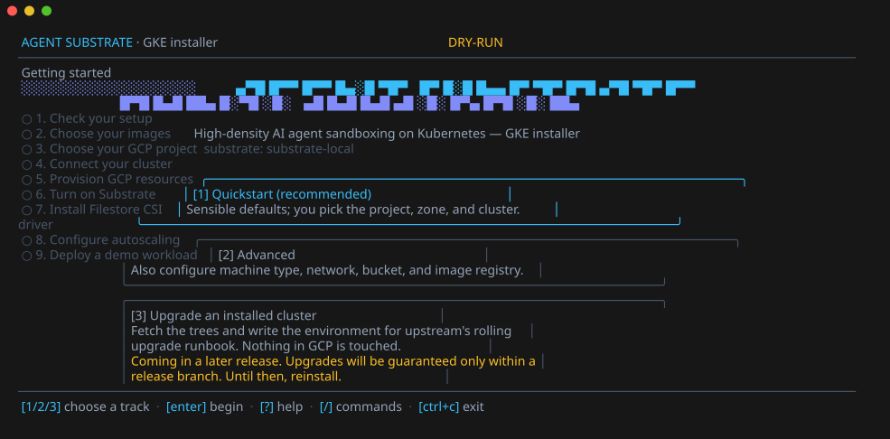
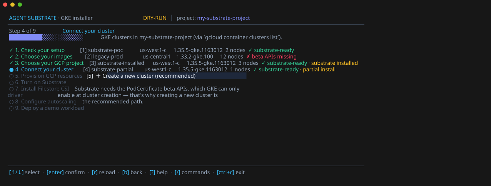
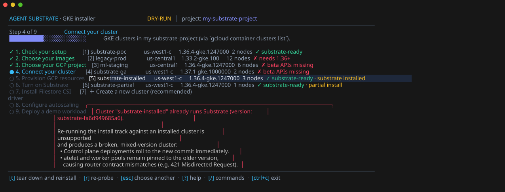
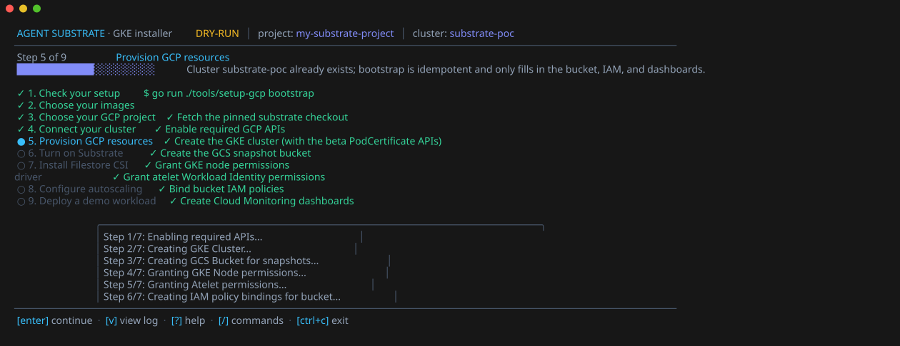
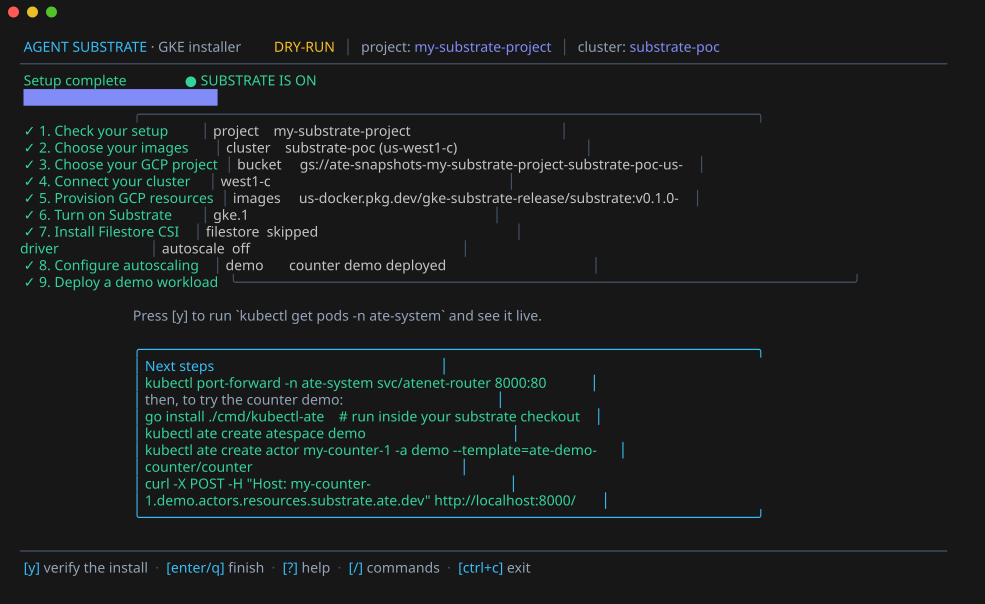

# substrate-gke

GKE packaging for [Agent Substrate](https://github.com/agent-substrate/substrate): an interactive terminal installer that provisions the required GCP resources and installs the Substrate control plane onto a GKE cluster.

> [!TIP]
> **New here?** Run `make dry-run` first — it walks the entire wizard without touching GCP, so you can see every prompt before committing to anything.

> [!WARNING]
> **This creates billable GCP resources.** A completed install provisions a GKE cluster, a snapshot bucket, IAM bindings, and monitoring dashboards. See [Tearing down](#tearing-down) to remove them — the wizard prints the exact cleanup command at the end of every install.



## Table of contents

- [Quickstart](#quickstart)
- [What the installer does](#what-the-installer-does)
- [Where the images come from](#where-the-images-come-from)
- [How Substrate itself is obtained](#how-substrate-itself-is-obtained)
- [Logs](#logs)
- [Upgrading an installed cluster](#upgrading-an-installed-cluster)
- [Tearing down](#tearing-down)
- [Development](#development)
- [Glossary](#glossary)

## Quickstart

**Prerequisites**

| Tool | Notes |
|---|---|
| `gcloud` | Authenticated, with [application-default credentials](https://cloud.google.com/docs/authentication/provide-credentials-adc) |
| Go | Version checked automatically — run `make substrate-pin-check` if unsure |
| `git` | — |
| `kubectl` | — |

```bash
# One-line install and launch:
curl -sSL https://raw.githubusercontent.com/ai-on-gke/substrate-gke/main/install.sh | bash
```

Or from a local clone:

```bash
git clone https://github.com/ai-on-gke/substrate-gke.git
cd substrate-gke
gcloud auth application-default login
make run          # launch the interactive installer
```

**Useful variants**

| Command | What it does |
|---|---|
| `make doctor` | Preflight checks only — no GCP calls |
| `make dry-run` | Walks the full wizard without touching GCP |

## What the installer does

A terminal wizard walks the nine steps below, running the real command it shows and streaming its output as it goes:

| # | Step | What happens |
|---|---|---|
| 1 | ✅ Check your setup | Probes `gcloud`, application-default credentials, Go, `kubectl`, network reachability, and `git` — with copy-paste fixes for anything missing |
| 2 | 🖼️ Choose your images | Pre-built images (the default), or build your own from a commit — see [Where the images come from](#where-the-images-come-from) |
| 3 | 🏗️ Choose your GCP project | Validated live with `gcloud projects describe` |
| 4 | 🔗 Connect your cluster | Lists your GKE clusters with install-state badges, or creates a new one. Clusters already running Substrate are protected by a reinstall guard |
| 5 | ⚙️ Provision GCP resources | `setup-gcp bootstrap` — APIs, cluster (if new), per-cluster snapshot bucket, IAM grants, and monitoring dashboards. Idempotent |
| 6 | 🚀 Turn on Substrate | `ate-setup deploy ate-system` — installs CRDs, the API server, controller, atenet, and atelet |
| 7 | 💾 Install Filestore CSI driver *(optional)* | Deploys the GCP Filestore CSI Driver configured for Substrate |
| 8 | 📈 Configure autoscaling *(optional)* | Node-pool autoscaling via `gcloud` |
| 9 | 🎬 Deploy a demo workload *(optional)* | Upstream counter demo, plus live verification and next steps |

> [!NOTE]
> Exiting and re-running is safe; every step is idempotent. A cluster that already runs Substrate is blocked from reinstall by the wizard's guard (preventing broken, mixed-version states); the wizard offers an in-place teardown or points at [Upgrading an installed cluster](#upgrading-an-installed-cluster) instead.

| Connect your cluster | Blocked: already installed |
| --- | --- |
|  |  |

| Provisioning | Complete |
| --- | --- |
|  |  |

<details>
<summary><strong>Why the steps are ordered this way</strong> (click to expand)</summary>

- **Setup check runs first** because the next step (images) is the first one to reach the network.
- **Images comes before the project step** because the answer decides what that step needs — a pre-built install pushes nothing, so it's never asked for a registry.
- **Connecting an existing cluster** probes it to confirm Substrate isn't already running there, guarding against mixed-version installs. Substrate needs the `PodCertificate` Kubernetes beta APIs, which GKE only enables **at cluster creation** — clusters created without them can't be fixed afterward. That's why creating a fresh cluster is the recommended path.
- **Filestore CSI driver** is optional and separate from autoscaling because configuring a Filestore VolumePool afterward is an additional step, not automatic.

</details>

## Where the images come from

The images step chooses between two ways of getting the Substrate control-plane images. Both name a commit of [`agent-substrate/substrate`](https://github.com/agent-substrate/substrate) — `ate-setup` reads deployment manifests from that source tree either way. The repository is fixed; the commit is yours to choose.

| | **Pre-built images** *(default)* | **Build from source** |
|---|---|---|
| **You provide** | Registry, tag, and commit — all pre-filled, all overridable | A revision: branch, tag, or full commit SHA |
| **Default value** | `v0.1.0-gke.1` at `us-docker.pkg.dev/gke-substrate-release/substrate`, pinned to upstream's [`v0.1.0`](https://github.com/agent-substrate/substrate/releases/tag/v0.1.0) | Repo's current HEAD, resolved live via `git ls-remote` |
| **Needs a registry of yours?** | No — pull-only | Yes — built with [ko](https://ko.build) and pushed there |
| **Best for** | Just getting Substrate running | A branch or commit with no published images |

> [!IMPORTANT]
> If you point at a custom registry/tag, **move the commit with it.** Only the release registry is guaranteed to match its tags — images from anywhere else need the commit they were built from, or they'll run behind manifests from a different Substrate. The wizard warns you as soon as the registry or tag changes.

<details>
<summary><strong>Other details worth knowing</strong> (click to expand)</summary>

- `ate-setup` pins every image to the digest its tag resolves to — nothing is built or pushed for a pre-built install.
- The tag doubles as the Substrate version (it names the atelet DaemonSet and sets the `ate.dev/substrate-version` node label), so it must be a valid Kubernetes label value. The wizard validates this at the prompt. A tag carrying its digest (`v0.1.0-gke.1@sha256:…`) is fine — the version is the tag alone.
- For build-from-source, a checkout of your own (fork included) is installed with `--substrate-root` instead — see [How Substrate itself is obtained](#how-substrate-itself-is-obtained).
- Whatever you name is resolved to an exact commit *before* the install starts, and checked against the remote via a filtered shallow fetch — so a naming mismatch is caught at the prompt, not ten minutes into an install.

</details>

## How Substrate itself is obtained

`ate-setup` needs a Substrate source tree on disk at install time regardless of which images you chose — a pre-built install skips the *build*, not the *checkout*. That's why both paths in the images step ask for a revision.

The installer fetches it with a shallow `git` fetch pinned to an exact commit, into:

```
<user cache dir>/substrate-gke/substrate-<short commit>
```

One directory per commit, so two revisions never collide. The default pin is public, so no credentials are needed for it.

> [!CAUTION]
> This tree is scratch space for **one install**, not somewhere to work. **It is deleted once the install succeeds**, and re-running the installer fetches it again. If you want to develop against Substrate, use your own clone — see below.

```bash
# Point at your own checkout instead (handy for testing an unmerged change):
cd installer && go run . --substrate-root=/path/to/substrate
```

A checkout you supply this way is used as-is and never modified or deleted.

<details>
<summary><strong>Failure and retry behavior</strong> (click to expand)</summary>

- Nothing is deleted while an install could still be retried — a failed run leaves the tree in place, so retrying costs no re-download.
- The tree is staged under a temporary name and moved into place only once complete, so an interrupted fetch costs you the download and nothing else.

</details>

## Logs

Every command's full output is written to a timestamped log under `<user cache dir>/substrate-gke/logs/`. Press `v` in the wizard for a scrollable log viewer; failures show the extracted cause and the log path.

## Upgrading an installed cluster

> [!CAUTION]
> Do not re-run the install track against a cluster that already runs Substrate (the wizard blocks it). Run the installer and choose **Upgrade an installed cluster** instead.

That flow names the cluster, reads what it currently runs, takes the new version from the images step, fetches both the installed and new source trees into `<user cache dir>/substrate-gke/upgrades/`, and prints the hand-over in runbook order for upstream's [rolling upgrade runbook](https://github.com/agent-substrate/substrate/blob/main/docs/upgrade.md): the runbook itself, the variables its commands use, which tree to check out, the environment for `ate-setup`, and what a rollback changes. **Nothing on the cluster changes until you follow the runbook.**

The installed tree is fetched at the commit the running API server reports it was built from (Go stamps every binary; `ateapi --version` prints it). If the cluster can't be read, or the binary carries no commit, you'll be prompted to enter the commit, version, and — for pre-built images — the registry.

## Tearing down

An install creates **billable resources**: the GKE cluster, the snapshot bucket, IAM bindings, and monitoring dashboards.

```bash
./tools/cleanup-gcp --project <project> --cluster <cluster> --location <zone> --bucket <bucket>
# or:
make teardown PROJECT_ID=<project> CLUSTER_NAME=<cluster> CLUSTER_LOCATION=<zone> BUCKET_NAME=<bucket>
```

> [!TIP]
> The exit summary from your install prints this exact invocation pre-filled — copy it from there rather than retyping values.

The script asks for confirmation, then delegates deletion to upstream's `hack/teardown.sh` at the same pinned commit the installer built from. It's safe to re-run after a partial failure.

To remove **only** the Substrate control plane and keep the cluster:

```bash
ate-setup delete ate-system   # printed in the exit summary
```

APIs enabled by the install are left enabled — they cost nothing while unused.

## Development

```bash
make test         # unit tests, including a scripted dry-run walk of the wizard
make verify       # gofmt + go vet
make screenshots  # regenerate the README screenshots from the dry-run wizard
```

### Bumping the pinned commit

This changes what fresh installs get. Edit `Commit` in `installer/internal/snapshot/snapshot.go`, and update `MinGoVersion` next to it to match the `go` directive in that revision's `go.mod`.

```bash
make substrate-pin        # print the current pinned values
make substrate-pin-check  # verify MinGoVersion against upstream's go.mod — run after every bump
```

> [!WARNING]
> Skipping `make substrate-pin-check` after a bump lets the preflight doctor pass while the install fails mid-bootstrap.

Bump `ReleaseVersion` and `Commit` together when a newer release is published — `Commit` has to be the manifest revision those images were actually built from. All three (`Commit`, `ReleaseRepo`, `ReleaseVersion`) are defaults, not limits: the wizard accepts any registry, tag, or revision, and the build-from-source track never uses `Commit` at all.

## Glossary

| Term | Meaning |
|---|---|
| `ate-setup` | CLI that installs/upgrades/deletes the Substrate control plane on a cluster |
| `atenet`, `atelet` | Substrate control-plane components installed alongside the API server and controller |
| `PodCertificate` beta APIs | Kubernetes beta APIs Substrate requires; GKE only enables them at cluster creation time |
| Pinned commit | The exact commit of `agent-substrate/substrate` this installer's manifests and default images are built from |
